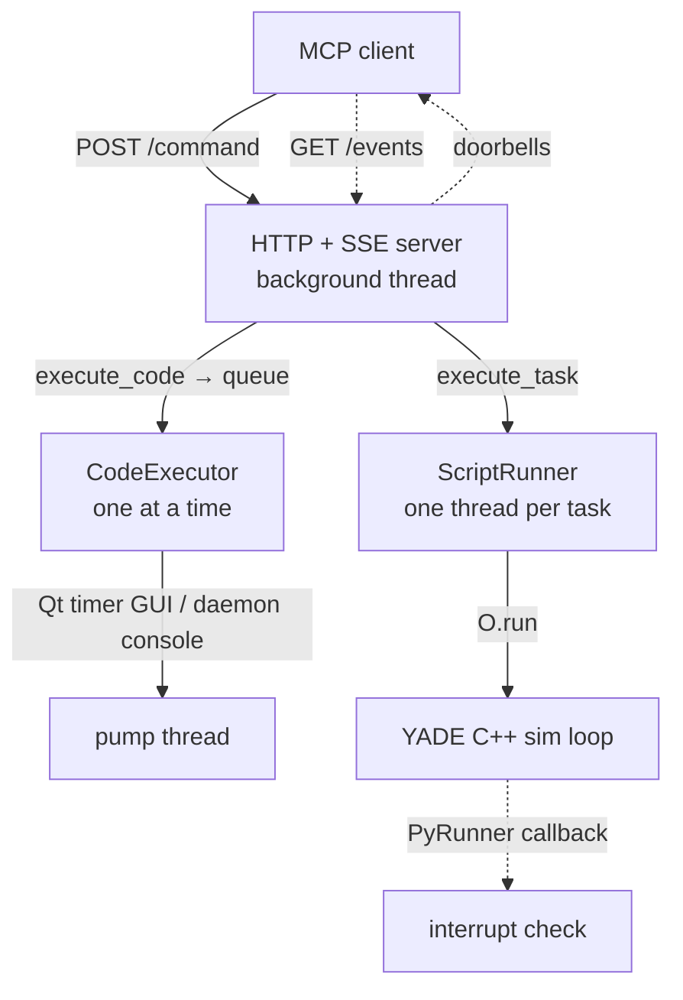

# yade-mcp-bridge

[](https://pypi.org/project/yade-mcp-bridge/)

HTTP + SSE bridge that runs inside a YADE process and enables execution tools for [yade-mcp](https://pypi.org/project/yade-mcp/).

## Features

- **Async tasks with progress polling.** Submit a long simulation script
  (`execute_task`) and poll its status and paginated log while it runs
  (`check_task_status`).
- **Live code during a run.** Send `execute_code` at any time to inspect
  state or tune parameters mid-cycle — no need to bake probes into the
  script up front. It shares the simulation's `__main__` namespace.
- **Graceful interrupt.** Stop a long cycling task on request
  (`interrupt_task`) without killing the YADE process.
- **Unified output capture.** Python `print` and YADE console output are
  interleaved in execution order in the task log.
- **Zero third-party dependencies.** Pure stdlib HTTP + SSE.

## Architecture

YADE's Qt GUI objects are main-thread-only, so the bridge keeps
`execute_code` on the main thread while running each task on its own
thread — a long `O.run()` then never blocks the server or live code.



- **HTTP + SSE server (background thread).** A threaded HTTP server takes
  `POST /<command>` request/response calls and serves one long-lived
  `GET /events` SSE stream. It hands work off rather than touching YADE
  directly, so lightweight calls (status, interrupt) stay responsive even
  while a long task runs.
- **execute_code pump.** `execute_code` submissions are serialized through
  a queue drained by a single pump — so concurrent submissions run one at a
  time instead of racing on YADE state. The pump is a Qt timer on the
  **main thread** in GUI mode (mandatory for `yade.qt` objects), or a
  background daemon thread in console mode.
- **Per-task threads.** `ScriptRunner` runs each `execute_task` script on
  its **own** background thread, so a cycling `O.run()` holds that thread,
  not the server or the main thread.
- **Cycle-gap interrupt.** A `PyRunner` callback fires periodically during
  `O.run()` to honor a pending `interrupt_task` within ~one step.
- **SSE doorbells.** Two no-payload server→client events
  (`task_status_changed`, `console_entry`) tell the client when to re-poll;
  all data travels over the plain `POST`/`GET` calls.

## HTTP protocol

The bridge is the source of truth for the wire contract — yade-mcp is a
client of it. A request is `POST /<command>` with a JSON body carrying a
`request_id`; the response echoes the `request_id`.

| Command | Purpose | Key fields |
| --- | --- | --- |
| `execute_task` | Submit a file-backed script as a tracked async task; the response returns the assigned `task_id` | `script_path`, `description` |
| `check_task_status` | Poll a task's status and paginated log | `task_id`, `skip_newest`, `limit`, `filter_text` |
| `list_tasks` | List known tasks | `offset`, `limit` |
| `interrupt_task` | Request a graceful interrupt of a running task | `task_id` |
| `execute_code` | Run a snippet in the shared `__main__` namespace | `code`, `timeout_ms` |
| `console_history` | Read captured console output | `limit` |

Server→client SSE events on `GET /events`: `task_status_changed`,
`console_entry`. `GET /health` reports liveness and runtime mode.

## Quick Start

In a YADE Python console, install the bridge using YADE's own interpreter:

```python
import sys, subprocess
subprocess.check_call([sys.executable, "-m", "pip", "install", "--user", "yade-mcp-bridge"])
```

On PEP 668 externally-managed environments (pip refuses `--user`), see the [bootstrap guide](https://github.com/yusong652/yade-mcp/blob/master/docs/agentic/yade-mcp-bootstrap.md) for a portable form.

Restart YADE, then in the Python console:

```python
import yade_mcp_bridge
yade_mcp_bridge.start()
```

The bridge auto-detects the runtime: Qt timer in GUI mode, blocking poll in console mode.

Expected output (one line):

```text
YADE MCP Bridge on http://localhost:9002, log: /your-working-dir/.yade-mcp/bridge.log
```

Detailed initialization logs go to `bridge.log` only (stdout shows warnings and errors).

## Options

```python
yade_mcp_bridge.start(
    host="localhost",   # Server host
    port=9002,          # Server port
    mode="auto",        # "auto", "gui", or "console"
)
```

## Requirements

- Python >= 3.8
- YADE with Python bindings
- No third-party dependencies (stdlib HTTP + SSE)

## Troubleshooting

| Symptom | Fix |
| --- | --- |
| Port in use | `yade_mcp_bridge.start(port=9003)`, then set `YADE_MCP_BRIDGE_URL=http://localhost:9003` |
| Connection failed | Check bridge is running, see `.yade-mcp/bridge.log` |
| PyRunner not available | YADE installation may lack PyRunner; interrupt checking during `O.run()` will be disabled |

## Development

Run the bridge from source inside YADE:

```python
import sys
sys.path.insert(0, '/path/to/yade-mcp/yade-mcp-bridge/src')
import yade_mcp_bridge
yade_mcp_bridge.start()
```

Code changes take effect on the next restart + `start()`.

## Relationship to MCP servers

This package is the in-process runtime only. Pair it with an MCP server
that speaks its HTTP + SSE protocol — [yade-mcp](https://pypi.org/project/yade-mcp/) —
for full client setup.

License: MIT ([LICENSE](https://github.com/yusong652/yade-mcp/blob/main/LICENSE)).
